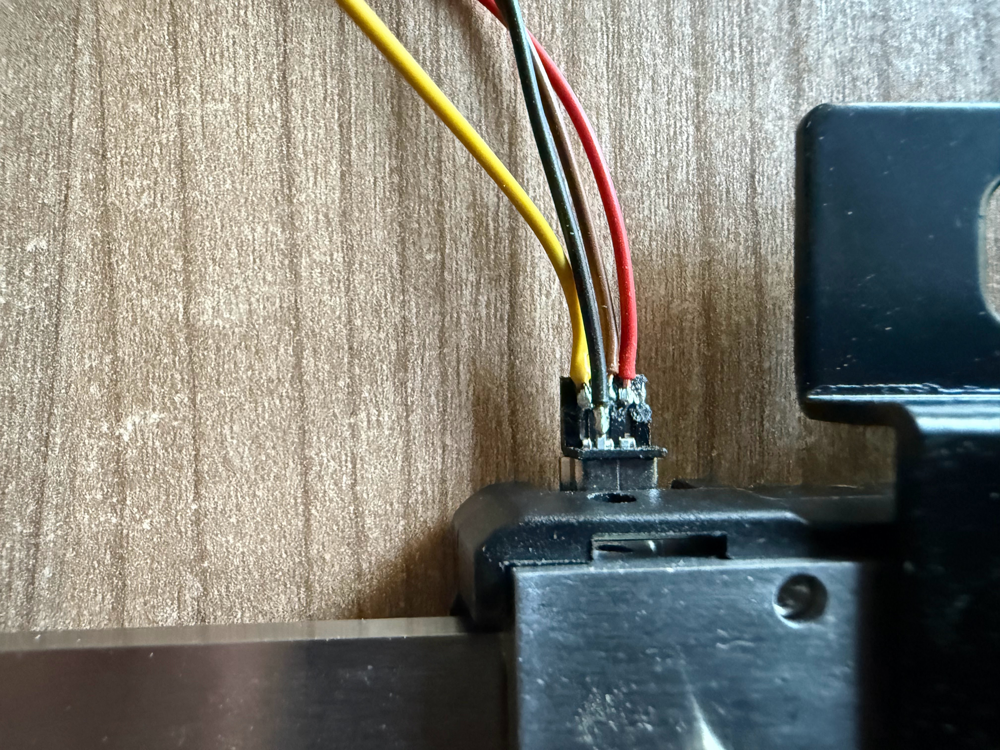

# digicaliper

ISR-driven ESP32 driver for cheap 24-bit Chinese digital calipers.

Reads the standard 24-bit serial protocol used by virtually all inexpensive
digital calipers sold on Amazon and AliExpress.  No polling, no blocking —
the ISR accumulates bits in the background and `read()` consumes them from
`loop()`.

Protocol reference: <https://makingstuff.info/Projects/Digital_Calipers>  
Tested hardware: [Asune 150 mm Digital Caliper (Amazon DE B0CQ549HQD)](https://www.amazon.de/dp/B0CQ549HQD)

---

## Features

- Fully interrupt-driven — single `CHANGE` ISR on the CLK line
- Sync detection via LOW-gap measurement (no extra timer or pin required)
- Signed integer result: `whole` + `frac` hundredths, no floating point
- `mm` / `inch` unit flag returned with every reading
- Drop-in: two source files, one `#include`

---

## Hardware

### The caliper connector

Most cheap calipers expose a USB-mini-style socket that carries the serial
data — **this is not USB**.  The socket is repurposed as a simple 3-wire
interface carrying GND, DATA, and CLK.



> Wire colours vary between manufacturers — check with a multimeter if in
> doubt.  The photo above shows the connector on the tested unit (Asune 150 mm).

The three active pins carry:

| Pin    | Signal | Level        |
|--------|--------|--------------|
| 1      | GND    | —            |
| 3      | DATA   | 1.5 V logic  |
| 4      | CLK    | 1.5 V logic  |

> **Important — 1.5 V logic!**  The caliper runs from a CR2032 cell.  Its
> output swings between 0 V and ~1.5 V, which is below the 3.3 V GPIO
> input-high threshold of the ESP32.  A level-shifter is required; direct
> connection will not work reliably.

---

### Level-shifter circuit

One inverting NPN stage per signal line (DATA and CLK).  The inversion is
handled in software — the driver is written to expect it.

**Per-channel schematic (repeat for DATA and CLK):**

```
Caliper wire (1.5 V logic)         ESP32 GPIO (3.3 V)
                                        │
                                   3V3 ─┤
                                        │
                                      10 kΩ  (pull-up)
                                        │
                              ┌─────────┤──── GPIO pin
                              │      Collector
                        10 kΩ │       Q1
caliper ──────────────┤├──── Base    2N3904
                              │      Emitter
                              │         │
GND (shared) ─────────────────┴─────────┘
```

**Full two-channel board:**

```
3V3 ─┬─ 10kΩ ─┬─ CLK_ESP       3V3 ─┬─ 10kΩ ─┬─ DATA_ESP
     │         │                      │         │
     │      Collector              Collector
     │       Q1 (2N3904)            Q2 (2N3904)
     │       Base ─ 10kΩ ─ CLK      Base ─ 10kΩ ─ DATA
     │       Emitter                 Emitter
GND ─┴─────────┘              GND ─┴──────────┘
```

**BOM:** 2 × 2N3904 (or any general-purpose NPN), 4 × 10 kΩ resistor.

Signal sense after the level-shifter:

- Caliper CLK **high** → transistor ON → ESP CLK pin **low**
- Caliper DATA **high** (bit = 1) → transistor ON → ESP DATA pin **low**
- Caliper DATA **low** (bit = 0, also idle state) → transistor OFF → ESP DATA pin **high**

The ISR samples DATA at the falling CLK edge and interprets a low GPIO
reading as a `1` bit accordingly.

---

## Software

### Installation (PlatformIO)

**Option A — copy into `src/`**

Copy `src/DigitalCaliper.h` and `src/DigitalCaliper.cpp` into your project's
`src/` folder and add to `platformio.ini`:

```ini
build_src_filter = +<*.cpp>
```

**Option B — place under `lib/`**

```
your-project/
└── lib/
    └── digicaliper/
        ├── DigitalCaliper.h
        └── DigitalCaliper.cpp
```

PlatformIO discovers `lib/` automatically — no `build_src_filter` change
needed.

---

### Usage

```cpp
#include "DigitalCaliper.h"

// Construct: CLK pin first, DATA pin second
DigitalCaliper caliper(CLK_PIN, DATA_PIN);

void setup() {
    Serial.begin(115200);
    caliper.begin();   // attaches CHANGE interrupt to CLK pin
}

void loop() {
    CaliperReading r;
    if (caliper.read(r)) {
        // r.whole  — signed integer part   e.g. -12  for -12.34 mm
        // r.frac   — unsigned hundredths   e.g.  34  for -12.34 mm
        // r.unit   — CaliperUnit::MM or CaliperUnit::INCH
        Serial.printf("%+d.%02u %s\n",
            r.whole, r.frac,
            r.unit == CaliperUnit::MM ? "mm" : "in");
    }
}
```

`read()` returns `true` and fills `out` only when a fresh packet has arrived
since the last call.  Call it freely from `loop()` — it is cheap and
non-blocking.  If no new data is available it returns `false` and leaves
`out` unchanged.

A ready-to-flash example lives in [`examples/serial_log/`](examples/serial_log/).

---

### API reference

```cpp
DigitalCaliper(uint8_t clk_pin, uint8_t data_pin);
```
Construct the driver.  `clk_pin` is the GPIO connected to CLK (after the
level-shifter); `data_pin` to DATA.

```cpp
void begin();
```
Configure both pins as inputs and attach the CHANGE interrupt.  Call once
from `setup()`.

```cpp
bool read(CaliperReading& out);
```
Non-blocking.  Returns `true` and fills `out` when a fresh 24-bit packet
has been received since the last call.

```cpp
struct CaliperReading {
    const int16_t     whole;   // signed integer part
    const uint16_t    frac;    // unsigned hundredths (0–99)
    const CaliperUnit unit;    // MM or INCH
};

enum class CaliperUnit : uint8_t { MM = 0, INCH = 1 };
```

---

### Constraints

- One `DigitalCaliper` instance per program (the ISR uses a static pointer).
  Promote to an array if two calipers are needed simultaneously.
- Tested on **ESP32-S3**.  Should work on all ESP32 variants; `GPIO.in` and
  `esp_timer_get_time()` are ESP-IDF primitives available across the family.
- `CaliperReading` has `const` members and cannot be copy-assigned.  Always
  declare it first and pass it by reference to `read()`.

---

## Protocol

The caliper generates CLK; the ESP32 only listens.  Each packet is 24 bits,
LSB-first, at roughly 10 Hz.

| Bits  | Meaning                                       |
|-------|-----------------------------------------------|
| 0–15  | Unsigned magnitude in 0.01 mm units           |
| 16–19 | Unused / zero                                 |
| 20    | Sign flag — 0 = positive, 1 = negative        |
| 21–22 | Unused / zero                                 |
| 23    | Unit flag — 0 = mm, 1 = inch                  |

**Sync detection.**  The NPN level-shifter inverts both signals, so the
inter-packet idle (caliper CLK high) appears as a long LOW on the ESP32 GPIO
(~50–90 ms).  The driver measures the LOW duration between a falling edge and
the next rising edge.  A gap longer than 20 ms marks a packet boundary; the
accumulator and bit counter are reset on the next rising edge, and the
following 24 falling edges map directly to bits 0–23 with no phantom offset.

**Sampling edge.**  Data is valid on the caliper's rising CLK edge, which
(after inversion) is the *falling* edge on the ESP32 GPIO.  The ISR samples
DATA on every falling CLK edge and accumulates bits; rising edges are used
only for inter-packet gap measurement.

Full protocol documentation: <https://makingstuff.info/Projects/Digital_Calipers>

---

## License
Apache 2.0 — see [LICENSE](LICENSE).
MIT
